# Observability Agent System Architecture

## System Overview

The Observability Agent System is a distributed, AI-powered observability platform that provides comprehensive incident detection, analysis, and response capabilities. It integrates with existing monitoring tools and uses specialized agents to provide deep insights into system behavior and incidents.

The system is designed with a multi-tiered architecture that enables:
- Scalable processing of alerts from multiple monitoring systems
- Parallel analysis of incidents across different observability domains
- Collaborative intelligence through multi-agent teams
- Unified incident response coordination
- Persistent knowledge retention and learning

## High-Level Architecture

### Visual Representation


The diagram above shows the key components of the system and their interactions. For a detailed explanation, see the sections below.

Additionally, the following diagrams provide more detailed views of specific system components:
- [System Workflow Sequence](./diagrams/system-workflow.svg) - End-to-end alert processing flow
- [Multi-Agent Patterns](./diagrams/multi-agent-patterns.svg) - Visualization of collaboration patterns
- [Log Agent](./diagrams/log-agent.svg) - Sequential processing model of the Log Agent
- [Metric Agent](./diagrams/metric-agent.svg) - MapReduce processing model of the Metric Agent
- [Root Cause Agent](./diagrams/root-cause-agent.svg) - Hierarchical structure of the Root Cause Agent

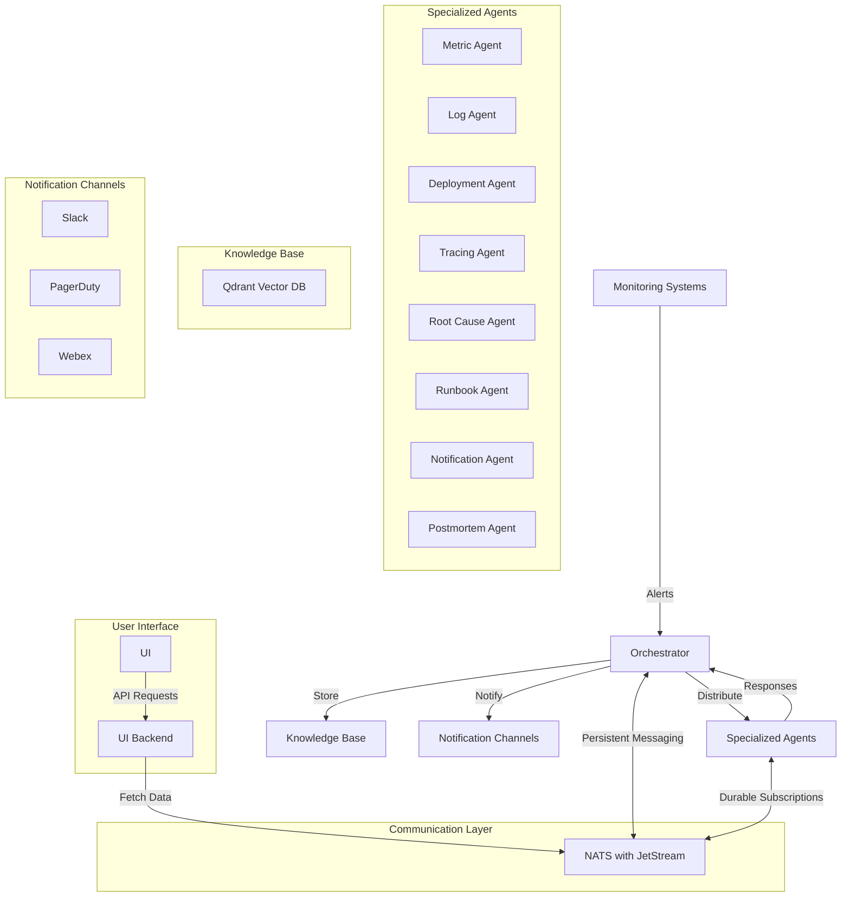

## Core Components

### 1. Orchestrator

The Orchestrator is the central coordination component responsible for:

- **Alert Management**: Receiving, deduplicating, and routing alerts to appropriate agents
- **Workflow Coordination**: Managing the lifecycle of incidents from detection to resolution
- **State Management**: Maintaining the state of ongoing incidents and agent tasks
- **Data Aggregation**: Collecting and correlating responses from different agents
- **Knowledge Integration**: Storing incident data and learnings in the vector database

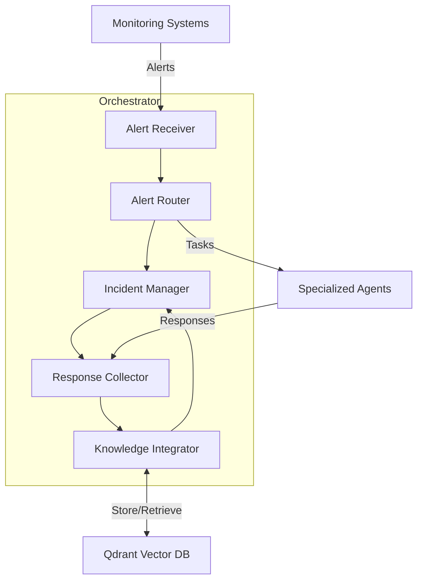

### 2. Specialized Agents

- **Metric Agent**: Analyzes time-series metrics for anomalies
- **Log Agent**: Processes and analyzes log patterns
- **Deployment Agent**: Monitors deployment status and issues
- **Tracing Agent**: Analyzes distributed traces
- **Root Cause Agent**: Identifies incident root causes
- **Runbook Agent**: Manages and executes runbooks
- **Notification Agent**: Handles alert notifications
- **Postmortem Agent**: Generates incident documentation

### 3. User Interface
- **UI Backend**: RESTful API service that provides data to the UI
- **UI**: Web interface for visualizing and interacting with the system

### 4. Knowledge Base (Qdrant)
- Vector storage for incident data
- Semantic search capabilities
- Historical incident tracking
- Runbook and postmortem storage

### 5. Communication Layer (NATS)
- Message streaming with JetStream
- Persistent, durable message delivery
- Advanced subject-based routing
- Queue groups for load balancing
- Configurable message retention
- Acknowledgment-based flow control

Each agent specializes in a specific domain of observability and operates using multi-agent teams for comprehensive analysis:

#### Metric Agent

Analyzes time-series metrics from systems like Prometheus to identify patterns, trends, and anomalies.

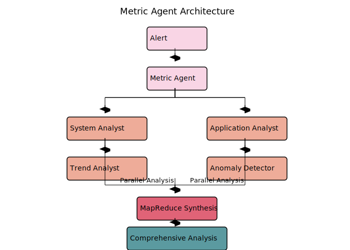

- **System Metrics Analyst**: Focuses on infrastructure metrics (CPU, memory, disk)
- **Application Metrics Analyst**: Examines service-level metrics (requests, errors, latency)
- **Trend Analyst**: Detects long-term patterns and gradual changes
- **Anomaly Detector**: Identifies statistical outliers and sudden changes

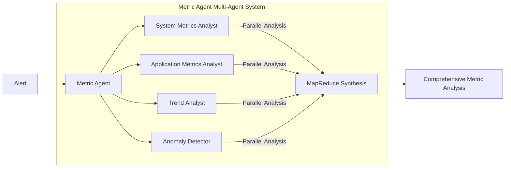

#### Log Agent

Processes and analyzes log data from various sources to extract meaningful patterns and indicators.

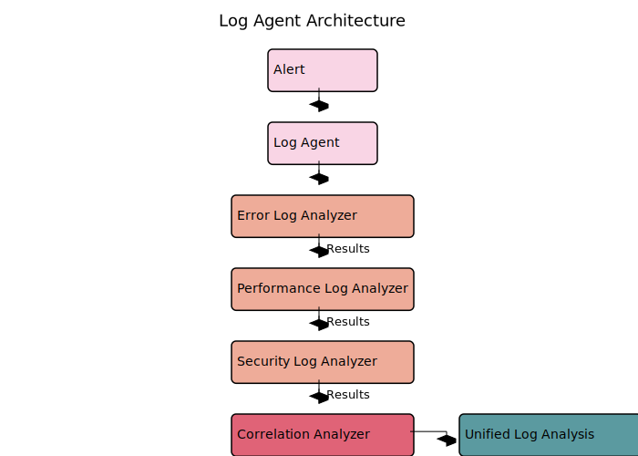

- **Error Log Analyzer**: Specializes in error messages and exception analysis
- **Performance Log Analyzer**: Focuses on performance-related log entries
- **Security Log Analyzer**: Identifies security-relevant log patterns
- **Correlation Analyzer**: Connects patterns across different log sources

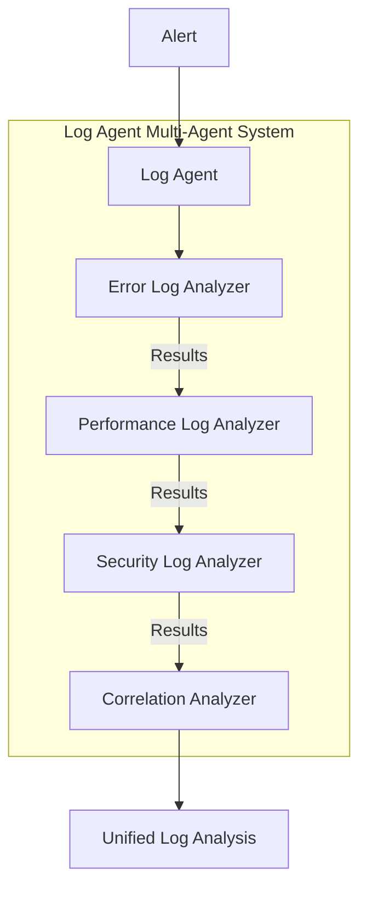

#### Root Cause Agent

Synthesizes data from other agents to determine the most likely root cause of incidents.


- **Root Cause Manager**: Coordinates analysis and synthesizes findings
- **Infrastructure Analyst**: Focuses on physical and virtual infrastructure
- **Application Analyst**: Specializes in application and code-level issues
- **Database Analyst**: Analyzes database performance and data problems
- **Network Analyst**: Examines connectivity and communication issues

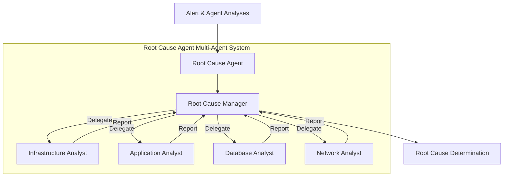

#### Runbook Agent

Manages the execution of incident response procedures, either automatically or by guiding human operators.

- **Runbook Finder**: Locates relevant runbooks in the knowledge base
- **Runbook Adapter**: Customizes procedures for the specific incident
- **Runbook Validator**: Ensures steps are correct and comprehensive
- **Automation Expert**: Identifies opportunities for automated execution

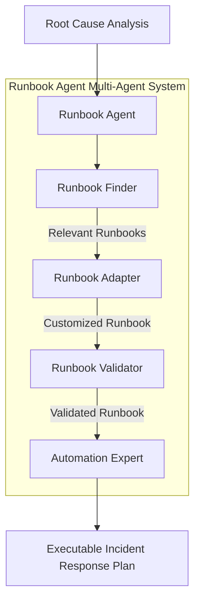

#### Postmortem Agent

Generates comprehensive incident documentation and learning resources.

- **Technical Analyst**: Analyzes technical details of the incident
- **Impact Analyst**: Assesses business and user impact
- **Timeline Constructor**: Creates a chronological incident narrative
- **Remediation Planner**: Develops future prevention plans
- **Postmortem Editor**: Synthesizes input into a cohesive document

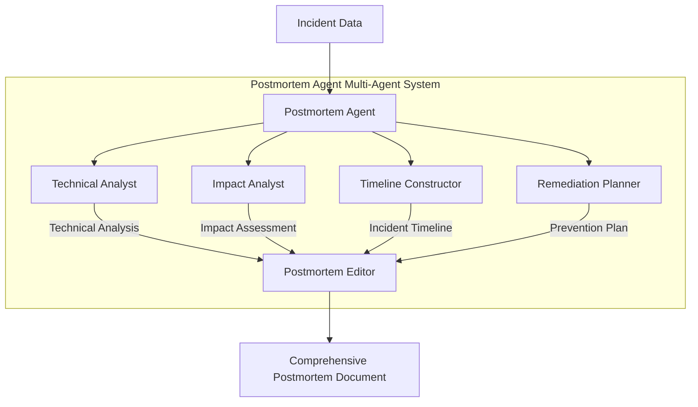

#### Other Specialized Agents

- **Deployment Agent**: Analyzes changes in deployments and configurations
- **Tracing Agent**: Examines distributed traces to identify service dependencies and bottlenecks
- **Notification Agent**: Manages communications with stakeholders

## Multi-Agent Architecture

The system implements a multi-agent approach using CrewAI to enhance analysis capabilities. Each specialized agent contains multiple sub-agents with focused expertise, working together as a crew to provide comprehensive analysis.

### Multi-Agent Design Principles

The multi-agent architecture is built on several key design principles:

1. **Specialization**: Each agent focuses on a specific domain or skill
2. **Collaboration**: Agents work together to solve complex problems
3. **Information Flow**: Clear patterns for sharing results between agents
4. **Synthesis**: Methods for combining insights into coherent outputs
5. **Extensibility**: Easy addition of new specialized agents as needed

### Multi-Agent Patterns

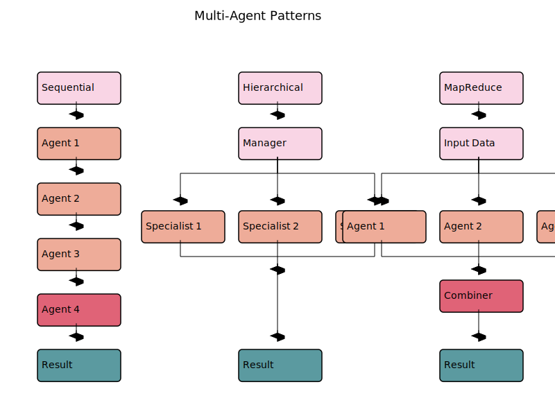

Different agents utilize various collaboration patterns depending on their analytical needs:

#### 1. Sequential Process

Agents work one after another in a pipeline, with results passed from one agent to the next. This pattern is ideal when each agent builds upon the analysis of previous agents.

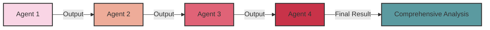

**Used by**: Postmortem Agent, Runbook Agent, Log Agent

**Key characteristics**:
- Ordered execution of agents
- Each agent has access to all previous outputs
- Final agent synthesizes the complete analysis
- Well-suited for processes with clear stages

#### 2. Hierarchical Process

A manager agent coordinates specialized sub-agents, delegates tasks, and synthesizes their findings. This pattern works well for complex analyses requiring oversight and coordination.

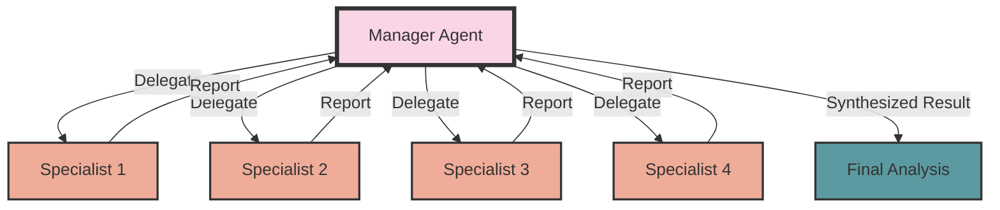

**Used by**: Root Cause Agent

**Key characteristics**:
- Central coordinator manages the process
- Specialists focus on domain-specific analyses
- Manager maintains global context
- Manager resolves conflicts between specialists
- Well-suited for complex problems requiring diverse expertise

#### 3. MapReduce Process

Agents work in parallel on different aspects of the same data, and their results are combined at the end. This pattern enables efficient processing of complex data with multiple dimensions.

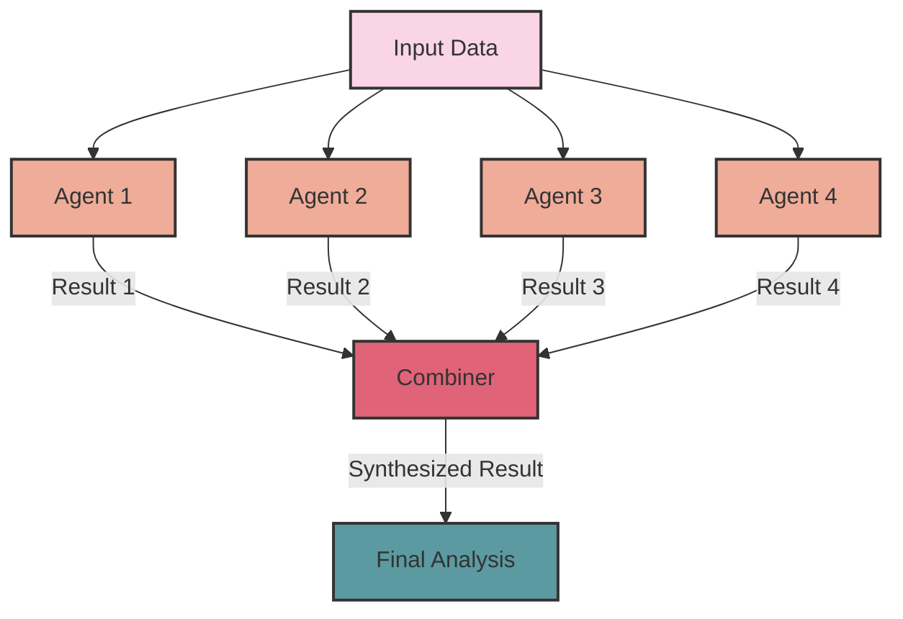

**Used by**: Metric Agent

**Key characteristics**:
- Parallel processing of different aspects
- Independent analysis by each agent
- Combination of results at the end
- Efficient for large datasets with multiple dimensions
- Well-suited for time-sensitive analyses

### Agent Implementation with CrewAI

The multi-agent system is implemented using CrewAI, which provides a framework for creating and managing teams of AI agents. The key components include:

```python
from crewai import Agent, Task, Crew
from crewai import process

# Create specialized agents
system_metrics_analyst = Agent(
    role="System Metrics Analyst",
    goal="Analyze system-level metrics to identify resource constraints",
    backstory="...",
    verbose=True,
    llm=llm,
    tools=[
        prometheus_tool.get_cpu_metrics,
        prometheus_tool.get_memory_metrics,
        metric_analysis_tool.analyze_threshold
    ]
)

application_metrics_analyst = Agent(
    role="Application Metrics Analyst",
    goal="Analyze application-specific metrics to identify service issues",
    backstory="...",
    verbose=True,
    llm=llm,
    tools=[
        prometheus_tool.get_error_rate,
        prometheus_tool.get_service_health,
        metric_analysis_tool.analyze_metrics
    ]
)

# Create tasks for each agent
system_task = Task(
    description="Analyze system-level metrics for the given alert...",
    agent=system_metrics_analyst,
    expected_output="A detailed analysis of system-level metrics"
)

application_task = Task(
    description="Analyze application-level metrics for the given alert...",
    agent=application_metrics_analyst,
    expected_output="A detailed analysis of application-level metrics"
)

# Create a crew with the specialized agents
crew = Crew(
    agents=[system_metrics_analyst, application_metrics_analyst, ...],
    tasks=[system_task, application_task, ...],
    verbose=True,
    process=process.MapReduce()  # Could also be Sequential() or Hierarchical()
)

# Execute the crew's analysis
result = crew.kickoff()
```

This approach allows each agent to focus on its specific domain while contributing to a comprehensive analysis through collaborative work.

## Tool Integrations

The system uses the CrewAI framework with tool decorators for agent functionality. This provides a standardized way to integrate with various monitoring and observability systems:

```python
from crewai.tools import tool

@tool("Analyze correlations between system components and events")
def correlation_analysis(events, time_window="1h", correlation_threshold=0.7):
    """
    Analyzes correlations between different monitoring events to identify relationships.
    
    Args:
        events: List of events to analyze
        time_window: Time window for correlation analysis
        correlation_threshold: Minimum correlation coefficient to consider
        
    Returns:
        Dictionary containing correlation results
    """
    # Implementation of correlation analysis
    return {
        "correlations": {...},
        "time_window": time_window,
        "threshold": correlation_threshold
    }
```

Each agent has access to specific tools relevant to their domain:

1. **Metric Agent Tools**:
   - Query Prometheus metrics
   - Analyze time-series data
   - Detect anomalies and trends

2. **Log Agent Tools**:
   - Query logs from Loki, Elasticsearch, or files
   - Parse and analyze log patterns
   - Extract error messages and stack traces

3. **Root Cause Agent Tools**:
   - Correlation analysis across metrics and logs
   - Dependency analysis between services
   - Historical pattern matching

4. **Runbook Agent Tools**:
   - Search for relevant runbooks
   - Execute automated remediation steps
   - Track execution progress

5. **Postmortem Agent Tools**:
   - Generate incident timelines
   - Create impact assessments
   - Develop prevention plans

This approach allows agents to focus on their specific domain while maintaining a consistent API.

## Data Flow

The system follows a structured data flow pattern to process incidents from detection to resolution:

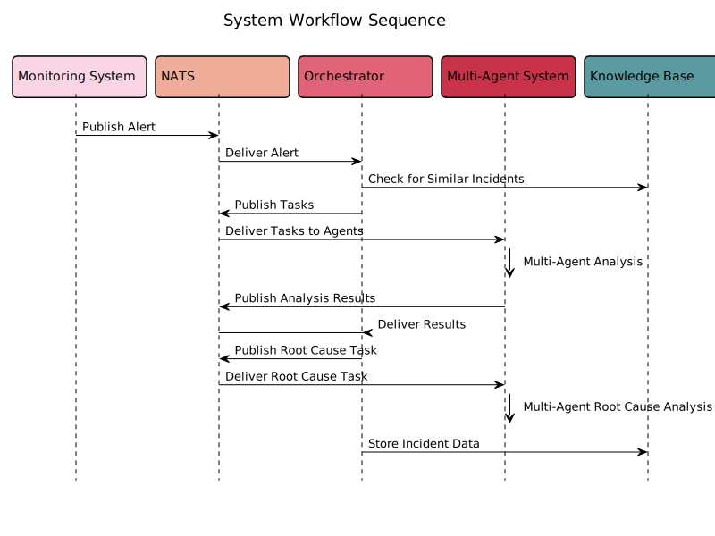

### 1. Alert Ingestion
```
Monitoring System -> NATS (alert_stream) -> Orchestrator
```

Alerts from monitoring systems are published to the `alert_stream` subject in NATS. The Orchestrator subscribes to this stream and processes incoming alerts.

### 2. Analysis Distribution
```
Orchestrator -> NATS (agent_tasks) -> Specialized Agents
```

The Orchestrator distributes analysis tasks to specialized agents by publishing messages to agent-specific subjects (e.g., `metric_agent`, `log_agent`).

### 3. Multi-Agent Processing
```
Agent -> Create Specialized Sub-Agents -> Form Crew -> Execute Tasks -> Synthesize Results
```

Each specialized agent creates a crew of sub-agents, assigns tasks, and executes the analysis using the appropriate collaboration pattern (Sequential, Hierarchical, or MapReduce).

### 4. Response Collection
```
Specialized Agents -> NATS (orchestrator_response) -> Orchestrator
```

Agents publish their analysis results back to the Orchestrator via the `orchestrator_response` subject.

### 5. Knowledge Integration
```
Orchestrator -> Qdrant -> Knowledge Base
```

The Orchestrator stores incident data, analyses, and learnings in the Qdrant vector database for future reference.

### 6. Notification Dispatch
```
Orchestrator -> NATS (notification_requests) -> Notification Agent -> Channels
```

### 6. UI Data Flow
```
UI -> UI Backend -> NATS (data requests) -> UI Backend -> UI


The Orchestrator sends notification requests to the Notification Agent, which then delivers alerts to appropriate channels (Slack, PagerDuty, email, etc.).

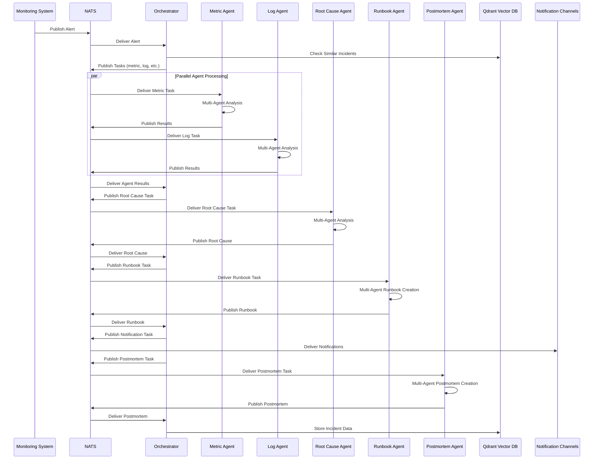

## Example Message Flow with NATS

### 1. Alert Received
```json
{
  "subject": "alert_stream",
  "data": {
    "alert_id": "cpu-spike-123",
    "labels": {
      "alertname": "HighCPUUsage",
      "service": "payment-service",
      "severity": "critical"
    },
    "annotations": {
      "description": "CPU usage above 90% for 5 minutes",
      "dashboard": "https://grafana.example.com/d/abc123"
    },
    "startsAt": "2025-05-10T10:00:00Z"
  }
}
```

### 2. Agent Task Distribution
```json
{
  "subject": "metric_agent",
  "data": {
    "alert_id": "cpu-spike-123",
    "labels": {
      "alertname": "HighCPUUsage",
      "service": "payment-service",
      "severity": "critical"
    },
    "annotations": {
      "description": "CPU usage above 90% for 5 minutes"
    },
    "startsAt": "2025-05-10T10:00:00Z"
  }
}
```

### 3. Agent Response
```json
{
  "subject": "orchestrator_response",
  "data": {
    "agent": "metric",
    "alert_id": "cpu-spike-123",
    "observed": "CPU utilization issue",
    "analysis": "CPU usage shows consistent spikes correlating with increased traffic...",
    "timestamp": "2025-05-10T10:05:00Z"
  }
}
```

## Use Cases

### 1. High CPU Usage Incident

**Scenario**: A service experiences sudden CPU spikes.

1. **Alert Reception**
   ```json
   {
     "alert_id": "cpu-spike-123",
     "labels": {
       "alertname": "HighCPUUsage",
       "service": "payment-service",
       "severity": "critical"
     },
     "annotations": {
       "description": "CPU usage above 90% for 5 minutes"
     },
     "startsAt": "2025-05-10T10:00:00Z"
   }
   ```

2. **Orchestrator Processing**
   - Alert is distributed to specialized agents via NATS
   - Tasks are created for Metric, Log, Deployment, and Tracing agents

3. **Multi-Agent Metric Analysis**
   - **System Metrics Analyst**: Analyzes CPU and memory usage
   - **Application Metrics Analyst**: Examines request rates and errors
   - **Trend Analyst**: Identifies gradual memory increase pattern
   - **Anomaly Detector**: Spots CPU spikes coinciding with traffic bursts
   - **Results are combined via MapReduce** into comprehensive metric analysis

4. **Multi-Agent Log Analysis**
   - **Error Log Analyzer**: Finds OutOfMemoryError patterns
   - **Performance Log Analyzer**: Identifies slow garbage collection
   - **Security Log Analyzer**: Confirms no security issues
   - **Correlation Analyzer**: Links memory errors with specific request patterns
   - **Sequential synthesis** produces comprehensive log analysis

5. **Multi-Agent Root Cause Analysis**
   - All specialized analyses sent to Root Cause Agent
   - **Manager Agent** coordinates Infrastructure, Application, Database, and Network analysts
   - **Application Analyst** identifies memory leak as highest confidence cause
   - **Hierarchical synthesis** produces final root cause determination

6. **Multi-Agent Runbook Generation**
   - **Runbook Finder** locates memory leak mitigation runbooks
   - **Runbook Adapter** customizes for payment service
   - **Runbook Validator** adds verification steps
   - **Automation Expert** identifies steps for automation
   - **Sequential refinement** produces executable runbook

7. **Multi-Agent Postmortem Creation**
   - Multiple specialists create different sections of the postmortem
   - **Postmortem Editor** combines all sections into cohesive document

### 2. Multi-Alert Correlation

**Scenario**: Multiple related alerts fire within a short time window.

1. **Alerts Reception**
   ```json
   [
     {
       "alert_id": "api-latency-001",
       "labels": {
         "alertname": "HighApiLatency",
         "service": "api-gateway",
         "severity": "warning"
       }
     },
     {
       "alert_id": "db-connections-002",
       "labels": {
         "alertname": "HighDbConnections",
         "service": "database",
         "severity": "warning"
       }
     },
     {
       "alert_id": "cache-miss-003",
       "labels": {
         "alertname": "HighCacheMissRate",
         "service": "redis-cache",
         "severity": "warning"
       }
     }
   ]
   ```

2. **Root Cause Correlation**
   - Root Cause Agent uses correlation_analysis tool with time_window="10m"
   - Identifies that database connection issues are the primary cause
   - Determines that cache misses and API latency are secondary effects

3. **Unified Response**
   - Single incident created for all related alerts
   - Notifications include correlation information
   - Runbook executed for database connection pool remediation
   - Comprehensive postmortem addresses all related symptoms

## Deployment Architecture

### Kubernetes Deployment

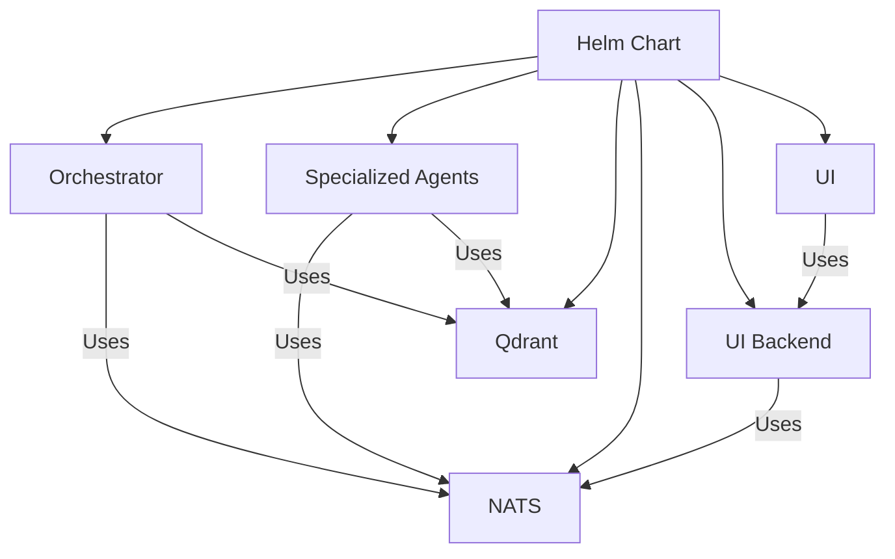

### NATS Streams Configuration

Each agent uses dedicated NATS streams and durable consumers:

```yaml
streams:
  - name: ALERTS
    subjects: ["alert_stream"]
    retention: limits
    max_age: 24h
  - name: AGENT_TASKS
    subjects: ["metric_agent", "log_agent", "deployment_agent", "tracing_agent",
               "root_cause_agent", "notification_agent", "postmortem_agent", "runbook_agent"]
    retention: limits
    max_msgs: 10000
  - name: RESPONSES
    subjects: ["orchestrator_response"]
    retention: limits
    max_msgs: 10000
```

## Security Considerations

1. **Authentication**
   - NATS authentication with user credentials
   - Service account permissions for Kubernetes
   - API key management for external systems

2. **Authorization**
   - NATS subject-based permissions
   - Role-based access control
   - Agent-specific permissions

3. **Data Protection**
   - TLS for NATS connections
   - Encrypted sensitive data in messages
   - Secure storage in Qdrant

## Performance Considerations

1. **Message Throughput**
   - NATS can handle millions of messages per second
   - JetStream provides persistence with minimal overhead
   - Queue groups enable load balancing across agent replicas

2. **Scalability**
   - Horizontal scaling of agent deployments
   - Independent scaling based on workload
   - NATS cluster for high availability

3. **Resource Efficiency**
   - NATS has a small footprint (10-20MB per instance)
   - Efficient message routing reduces network overhead
   - JetStream optimizes storage for persistence

4. **Multi-Agent Resource Usage**
   - Multi-agent approach requires more computation and token usage
   - Different process patterns (Sequential, Hierarchical, MapReduce) optimize for different scenarios
   - Token usage monitoring helps optimize agent configurations

## Monitoring and Maintenance

1. **System Health**
   - NATS server monitoring
   - Agent liveness/readiness probes
   - Message queue length monitoring

2. **Performance Metrics**
   - Alert processing time
   - Agent response time
   - JetStream persistence metrics

3. **Maintenance Tasks**
   - NATS stream pruning
   - Qdrant vector database optimization
   - Agent version upgrades

## Future Enhancements

1. **Planned Features**
   - Enhanced multi-alert correlation
   - Predictive incident detection
   - Automated remediation actions
   - Extension of multi-agent approach to remaining agents

2. **Integration Roadmap**
   - Additional monitoring systems
   - More notification channels
   - Advanced ML-based root cause analysis
   - Dynamic agent scaling based on incident complexity

## Conclusion

The Observability Agent System provides a comprehensive solution for incident detection, analysis, and response. Its architecture based on specialized agents, multi-agent collaboration patterns, NATS messaging, and vector knowledge storage enables deep insights into system behavior while maintaining high performance and reliability.

The multi-agent approach using CrewAI enables more thorough analysis by allowing specialized agents to focus on their areas of expertise while collaborating to provide comprehensive incident understanding. This approach significantly enhances the system's ability to:

1. **Detect complex patterns** across different observability signals
2. **Identify root causes** with higher accuracy and confidence
3. **Generate detailed remediation plans** tailored to specific incidents
4. **Create comprehensive documentation** for knowledge retention
5. **Learn from past incidents** to improve future responses

By leveraging both vertical specialization (different observability domains) and horizontal specialization (different analytical approaches within domains), the system provides a scalable, extensible platform for modern observability challenges.
