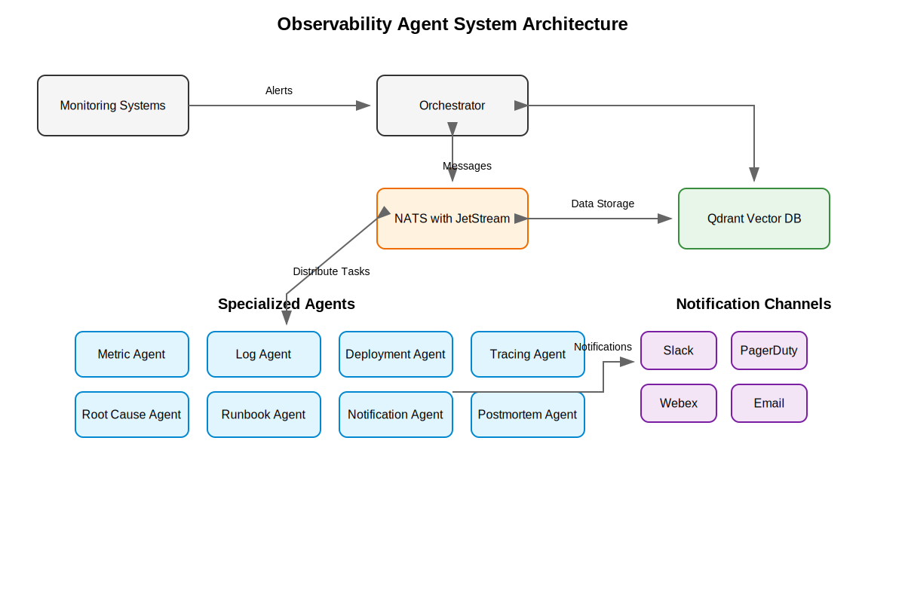
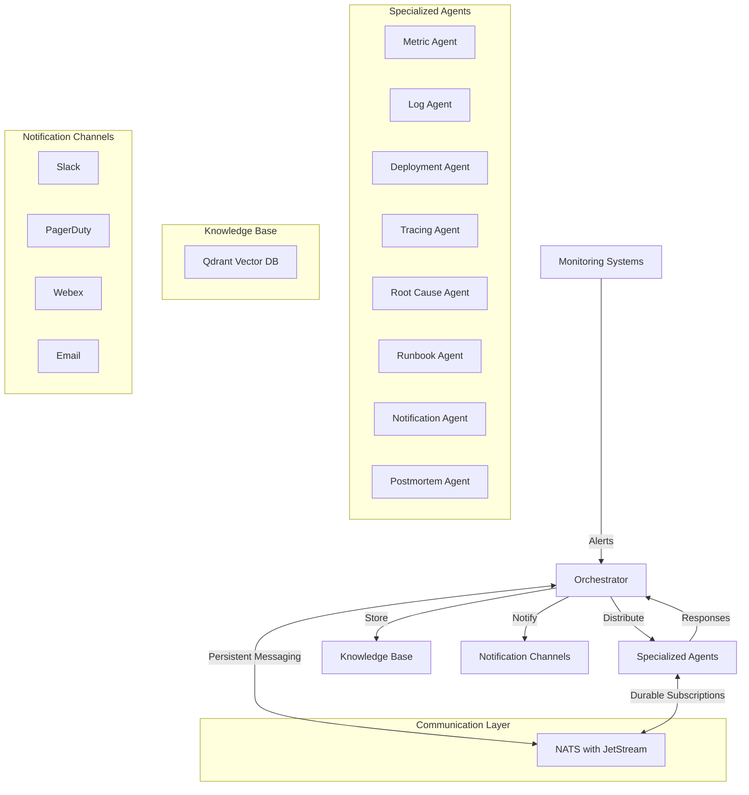
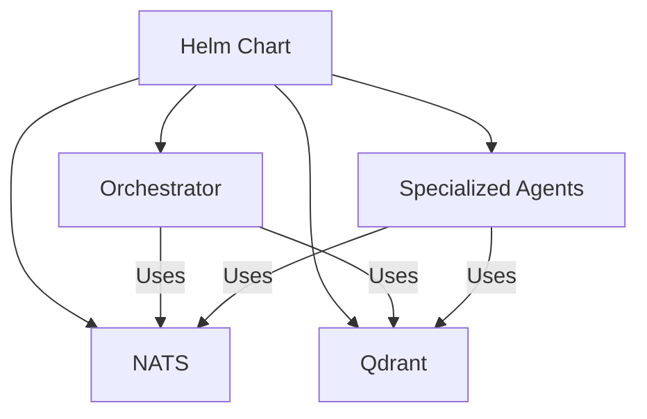

# Observability Agent System Architecture

## System Overview

The Observability Agent System is a distributed, AI-powered observability platform that provides comprehensive incident detection, analysis, and response capabilities. It integrates with existing monitoring tools and uses specialized agents to provide deep insights into system behavior and incidents.

## High-Level Architecture

### Visual Representation



The diagram above shows the key components of the system and their interactions. For a detailed explanation, see the sections below.



## Core Components

### 1. Orchestrator
- Central coordination component
- Manages alert distribution and response collection
- Maintains system state and knowledge base
- Coordinates incident response workflow

### 2. Specialized Agents
- **Metric Agent**: Analyzes time-series metrics for anomalies
- **Log Agent**: Processes and analyzes log patterns
- **Deployment Agent**: Monitors deployment status and issues
- **Tracing Agent**: Analyzes distributed traces
- **Root Cause Agent**: Identifies incident root causes
- **Runbook Agent**: Manages and executes runbooks
- **Notification Agent**: Handles alert notifications
- **Postmortem Agent**: Generates incident documentation

### 3. Knowledge Base (Qdrant)
- Vector storage for incident data
- Semantic search capabilities
- Historical incident tracking
- Runbook and postmortem storage

### 4. Communication Layer (NATS)
- Message streaming with JetStream
- Persistent, durable message delivery
- Advanced subject-based routing
- Queue groups for load balancing
- Configurable message retention
- Acknowledgment-based flow control

## Data Flow

1. **Alert Ingestion**
   ```
   Monitoring System -> NATS -> Orchestrator
   ```

2. **Analysis Distribution**
   ```
   Orchestrator -> NATS -> Specialized Agents
   ```

3. **Response Collection**
   ```
   Specialized Agents -> NATS -> Orchestrator
   ```

4. **Knowledge Integration**
   ```
   Orchestrator -> Qdrant -> Knowledge Base
   ```

5. **Notification Dispatch**
   ```
   Orchestrator -> NATS -> Notification Agent -> Channels
   ```

## Use Cases

### 1. High CPU Usage Incident

**Scenario**: A service experiences sudden CPU spikes.

1. **Alert Reception**
   ```json
   {
     "alert_id": "cpu-spike-123",
     "service": "payment-service",
     "metric": "cpu_usage",
     "value": "95%",
     "threshold": "80%",
     "timestamp": "2024-03-20T10:00:00Z"
   }
   ```

2. **Agent Analysis**
   - **Metric Agent**: Confirms CPU spike pattern
   - **Log Agent**: Identifies related error logs
   - **Deployment Agent**: Checks recent deployments
   - **Tracing Agent**: Analyzes request patterns

3. **Root Cause Analysis**
   ```json
   {
     "root_cause": "Memory leak in payment processing module",
     "confidence": 0.95,
     "evidence": [
       "CPU usage correlates with request volume",
       "Memory usage shows steady increase",
       "Recent deployment of payment module"
     ]
   }
   ```

4. **Response Actions**
   - **Runbook Agent**: Executes CPU spike mitigation
   - **Notification Agent**: Alerts on-call team
   - **Postmortem Agent**: Generates incident report

### 2. Service Degradation

**Scenario**: API response times increase significantly.

1. **Alert Reception**
   ```json
   {
     "alert_id": "latency-spike-456",
     "service": "api-gateway",
     "metric": "p95_latency",
     "value": "2.5s",
     "threshold": "1s",
     "timestamp": "2024-03-20T11:00:00Z"
   }
   ```

2. **Agent Analysis**
   - **Metric Agent**: Analyzes latency patterns
   - **Log Agent**: Checks for error rates
   - **Tracing Agent**: Identifies slow endpoints
   - **Deployment Agent**: Reviews recent changes

3. **Root Cause Analysis**
   ```json
   {
     "root_cause": "Database connection pool exhaustion",
     "confidence": 0.90,
     "evidence": [
       "High number of pending database connections",
       "Increased error rates in database queries",
       "Recent traffic spike"
     ]
   }
   ```

4. **Response Actions**
   - **Runbook Agent**: Executes connection pool reset
   - **Notification Agent**: Notifies database team
   - **Postmortem Agent**: Documents incident

## Deployment Architecture

### Kubernetes Deployment



### Resource Requirements

1. **Orchestrator**
   - CPU: 100m-500m
   - Memory: 256Mi-512Mi

2. **Specialized Agents**
   - CPU: 100m-200m each
   - Memory: 128Mi-256Mi each

3. **Qdrant**
   - CPU: 200m-500m
   - Memory: 256Mi-512Mi
   - Storage: 10Gi-20Gi

4. **NATS**
   - CPU: 100m-200m
   - Memory: 128Mi-256Mi

## Security Considerations

1. **Authentication**
   - API key management
   - Service account permissions
   - NATS authentication

2. **Authorization**
   - Role-based access control
   - Agent permissions
   - API access control

3. **Data Protection**
   - Encrypted communication
   - Secure storage
   - Audit logging

## Monitoring and Maintenance

1. **System Health**
   - Agent status monitoring
   - Resource utilization
   - Error rates

2. **Performance Metrics**
   - Alert processing time
   - Agent response time
   - Knowledge base operations

3. **Maintenance Tasks**
   - Regular backups
   - Log rotation
   - Knowledge base cleanup

## Future Enhancements

1. **Planned Features**
   - Multi-cluster support
   - Advanced ML models
   - Extended agent capabilities

2. **Integration Roadmap**
   - Additional monitoring systems
   - New notification channels
   - Enhanced analytics

## Conclusion

The Observability Agent System provides a comprehensive solution for incident detection, analysis, and response. Its distributed architecture and specialized agents enable deep insights into system behavior, while the knowledge base ensures continuous learning and improvement of incident response capabilities.
