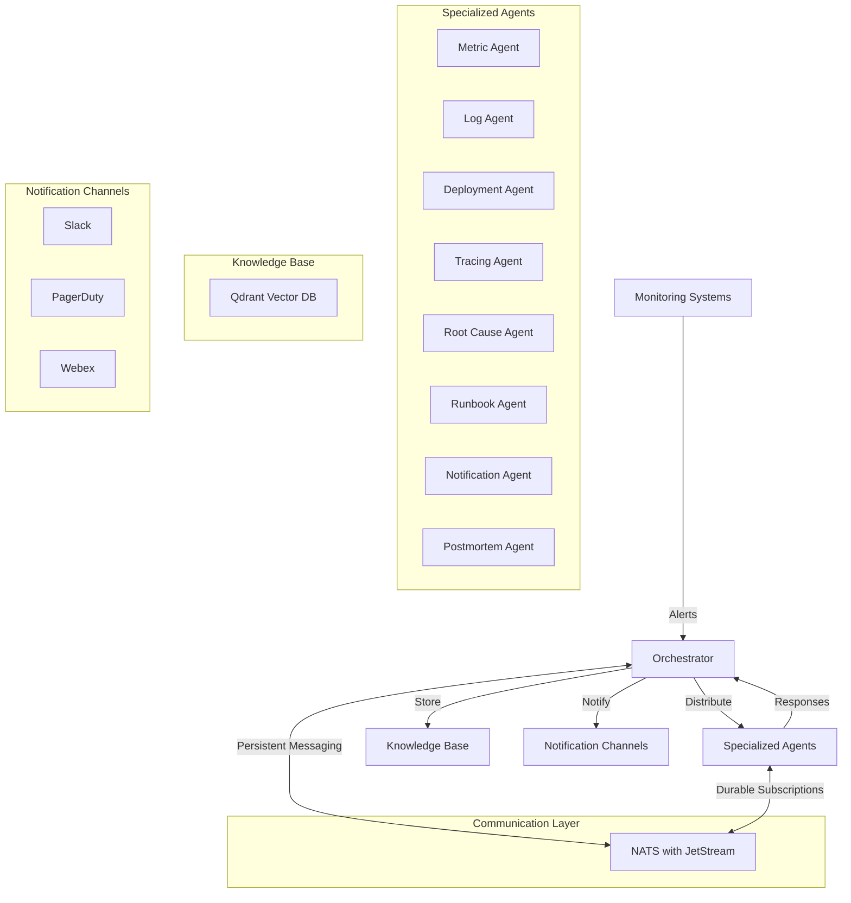
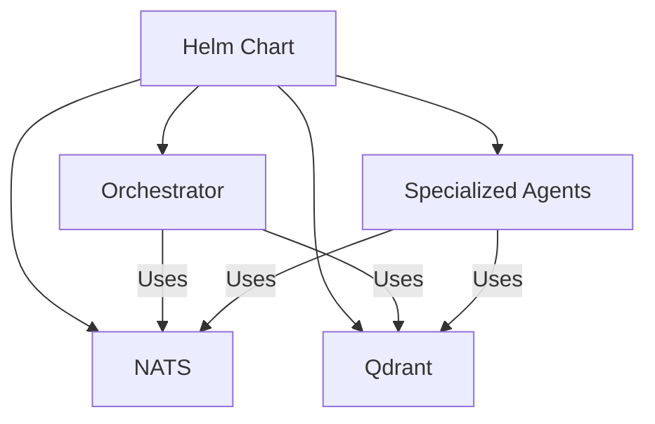

# Observability Agent System Architecture

## System Overview

The Observability Agent System is a distributed, AI-powered observability platform that provides comprehensive incident detection, analysis, and response capabilities. It integrates with existing monitoring tools and uses specialized agents to provide deep insights into system behavior and incidents.

## High-Level Architecture

### Visual Representation


The diagram above shows the key components of the system and their interactions. For a detailed explanation, see the sections below.



## Core Components

### 1. Orchestrator
- Central coordination component
- Manages alert distribution and response collection
- Maintains system state and knowledge base
- Coordinates incident response workflow

### 2. Specialized Agents
- **Metric Agent**: Analyzes time-series metrics for anomalies
- **Log Agent**: Processes and analyzes log patterns
- **Deployment Agent**: Monitors deployment status and issues
- **Tracing Agent**: Analyzes distributed traces
- **Root Cause Agent**: Identifies incident root causes
- **Runbook Agent**: Manages and executes runbooks
- **Notification Agent**: Handles alert notifications
- **Postmortem Agent**: Generates incident documentation

### 3. Knowledge Base (Qdrant)
- Vector storage for incident data
- Semantic search capabilities
- Historical incident tracking
- Runbook and postmortem storage

### 4. Communication Layer (NATS)
- Message streaming with JetStream
- Persistent, durable message delivery
- Advanced subject-based routing
- Queue groups for load balancing
- Configurable message retention
- Acknowledgment-based flow control

## Tool Integrations

The system uses the CrewAI framework with tool decorators for agent functionality:

```python
from crewai.tools import tool

@tool("Analyze correlations between system components and events")
def correlation_analysis(events, time_window="1h", correlation_threshold=0.7):
    # Implementation of correlation analysis
    return {
        "correlations": {...},
        "time_window": time_window,
        "threshold": correlation_threshold
    }
```

This approach allows agents to focus on their specific domain while maintaining a consistent API.

## Data Flow

### 1. Alert Ingestion
```
Monitoring System -> NATS (alert_stream) -> Orchestrator
```

### 2. Analysis Distribution
```
Orchestrator -> NATS (agent_tasks) -> Specialized Agents
```

### 3. Response Collection
```
Specialized Agents -> NATS (orchestrator_response) -> Orchestrator
```

### 4. Knowledge Integration
```
Orchestrator -> Qdrant -> Knowledge Base
```

### 5. Notification Dispatch
```
Orchestrator -> NATS (notification_requests) -> Notification Agent -> Channels
```

## Example Message Flow with NATS

### 1. Alert Received
```json
{
  "subject": "alert_stream",
  "data": {
    "alert_id": "cpu-spike-123",
    "labels": {
      "alertname": "HighCPUUsage",
      "service": "payment-service",
      "severity": "critical"
    },
    "annotations": {
      "description": "CPU usage above 90% for 5 minutes",
      "dashboard": "https://grafana.example.com/d/abc123"
    },
    "startsAt": "2025-05-10T10:00:00Z"
  }
}
```

### 2. Agent Task Distribution
```json
{
  "subject": "metric_agent",
  "data": {
    "alert_id": "cpu-spike-123",
    "labels": {
      "alertname": "HighCPUUsage",
      "service": "payment-service",
      "severity": "critical"
    },
    "annotations": {
      "description": "CPU usage above 90% for 5 minutes"
    },
    "startsAt": "2025-05-10T10:00:00Z"
  }
}
```

### 3. Agent Response
```json
{
  "subject": "orchestrator_response",
  "data": {
    "agent": "metric",
    "alert_id": "cpu-spike-123",
    "observed": "CPU utilization issue",
    "analysis": "CPU usage shows consistent spikes correlating with increased traffic...",
    "timestamp": "2025-05-10T10:05:00Z"
  }
}
```

## Use Cases

### 1. High CPU Usage Incident

**Scenario**: A service experiences sudden CPU spikes.

1. **Alert Reception**
   ```json
   {
     "alert_id": "cpu-spike-123",
     "labels": {
       "alertname": "HighCPUUsage",
       "service": "payment-service",
       "severity": "critical"
     },
     "annotations": {
       "description": "CPU usage above 90% for 5 minutes"
     },
     "startsAt": "2025-05-10T10:00:00Z"
   }
   ```

2. **Orchestrator Processing**
   - Alert is distributed to specialized agents via NATS
   - Tasks are created for Metric, Log, Deployment, and Tracing agents

3. **Agent Analysis**
   - **Metric Agent**: Confirms CPU spike pattern
     ```json
     {
       "agent": "metric",
       "observed": "CPU utilization issue",
       "analysis": "CPU usage shows consistent spikes every 5 minutes"
     }
     ```
   - **Log Agent**: Identifies related error logs
     ```json
     {
       "agent": "log",
       "observed": "OOM errors",
       "analysis": "Multiple instances of OutOfMemoryError in payment processing"
     }
     ```
   - **Deployment Agent**: Checks recent deployments
     ```json
     {
       "agent": "deployment",
       "observed": "Recent deployment",
       "analysis": "New version deployed 30 minutes before incident"
     }
     ```

4. **Root Cause Analysis**
   - Orchestrator sends comprehensive data to Root Cause Agent
   - Root Cause Agent uses correlation_analysis tool to identify patterns
   ```json
   {
     "agent": "root_cause",
     "root_cause": "Memory leak in payment processing module",
     "confidence": 0.95,
     "evidence": [
       "CPU usage correlates with request volume",
       "Memory usage shows steady increase",
       "Recent deployment of payment module"
     ]
   }
   ```

5. **Response Actions**
   - **Notification Agent**: Alerts on-call team via Slack, PagerDuty, and Webex
   - **Runbook Agent**: Executes CPU spike mitigation runbook
   - **Postmortem Agent**: Generates incident report with Root Cause details

### 2. Multi-Alert Correlation

**Scenario**: Multiple related alerts fire within a short time window.

1. **Alerts Reception**
   ```json
   [
     {
       "alert_id": "api-latency-001",
       "labels": {
         "alertname": "HighApiLatency",
         "service": "api-gateway",
         "severity": "warning"
       }
     },
     {
       "alert_id": "db-connections-002",
       "labels": {
         "alertname": "HighDbConnections",
         "service": "database",
         "severity": "warning"
       }
     },
     {
       "alert_id": "cache-miss-003",
       "labels": {
         "alertname": "HighCacheMissRate",
         "service": "redis-cache",
         "severity": "warning"
       }
     }
   ]
   ```

2. **Root Cause Correlation**
   - Root Cause Agent uses correlation_analysis tool with time_window="10m"
   - Identifies that database connection issues are the primary cause
   - Determines that cache misses and API latency are secondary effects

3. **Unified Response**
   - Single incident created for all related alerts
   - Notifications include correlation information
   - Runbook executed for database connection pool remediation
   - Comprehensive postmortem addresses all related symptoms

## Deployment Architecture

### Kubernetes Deployment



### NATS Streams Configuration

Each agent uses dedicated NATS streams and durable consumers:

```yaml
streams:
  - name: ALERTS
    subjects: ["alert_stream"]
    retention: limits
    max_age: 24h
  - name: AGENT_TASKS
    subjects: ["metric_agent", "log_agent", "deployment_agent", "tracing_agent", 
               "root_cause_agent", "notification_agent", "postmortem_agent", "runbook_agent"]
    retention: limits
    max_msgs: 10000
  - name: RESPONSES
    subjects: ["orchestrator_response"]
    retention: limits
    max_msgs: 10000
```

## Security Considerations

1. **Authentication**
   - NATS authentication with user credentials
   - Service account permissions for Kubernetes
   - API key management for external systems

2. **Authorization**
   - NATS subject-based permissions
   - Role-based access control
   - Agent-specific permissions

3. **Data Protection**
   - TLS for NATS connections
   - Encrypted sensitive data in messages
   - Secure storage in Qdrant

## Performance Considerations

1. **Message Throughput**
   - NATS can handle millions of messages per second
   - JetStream provides persistence with minimal overhead
   - Queue groups enable load balancing across agent replicas

2. **Scalability**
   - Horizontal scaling of agent deployments
   - Independent scaling based on workload
   - NATS cluster for high availability

3. **Resource Efficiency**
   - NATS has a small footprint (10-20MB per instance)
   - Efficient message routing reduces network overhead
   - JetStream optimizes storage for persistence

## Monitoring and Maintenance

1. **System Health**
   - NATS server monitoring
   - Agent liveness/readiness probes
   - Message queue length monitoring

2. **Performance Metrics**
   - Alert processing time
   - Agent response time
   - JetStream persistence metrics

3. **Maintenance Tasks**
   - NATS stream pruning
   - Qdrant vector database optimization
   - Agent version upgrades

## Future Enhancements

1. **Planned Features**
   - Enhanced multi-alert correlation
   - Predictive incident detection
   - Automated remediation actions

2. **Integration Roadmap**
   - Additional monitoring systems
   - More notification channels
   - Advanced ML-based root cause analysis

## Conclusion

The Observability Agent System provides a comprehensive solution for incident detection, analysis, and response. Its architecture based on specialized agents, NATS messaging, and vector knowledge storage enables deep insights into system behavior while maintaining high performance and reliability.
